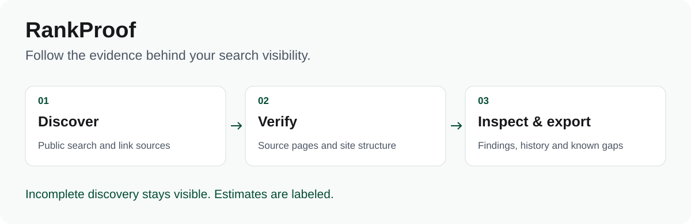
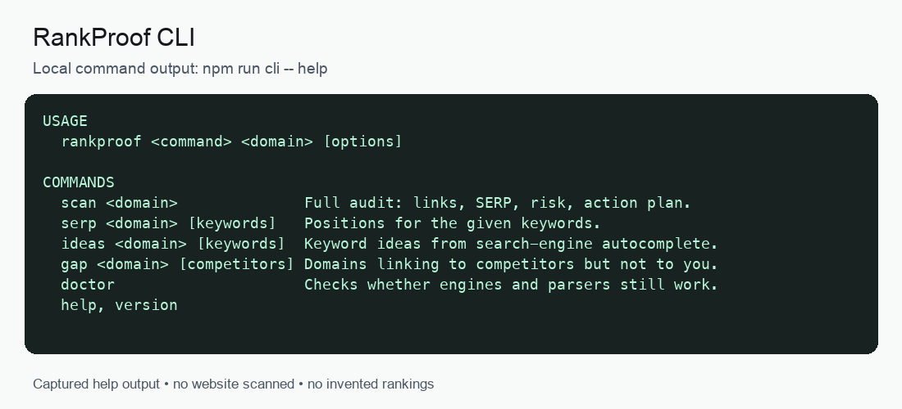

# RankProof

Audit search visibility, backlinks and internal links from your own machine. Inspect the evidence behind a finding and export the results.



[](https://github.com/CometWeb-io/rankproof/actions/workflows/ci.yml)
[](LICENSE)

**Node.js 22+ · Web UI, CLI and HTTP API · Version 8.1.0**

## Run locally

```bash
git clone https://github.com/CometWeb-io/rankproof.git
cd rankproof
npm ci
npm run dev
```

Open **http://localhost:8080**. Local history uses embedded PGLite when `DATABASE_URL` is unset. The development server binds to localhost.


## Try the CLI

```bash
npm run cli -- help
npm run cli -- scan example.com --market us --format json --out report.json
```

Replace `example.com` with a public site you are authorized to audit. Scans make network requests; engine blocks and missing data remain visible in the results.



*Animated excerpt of actual local command output. [Static version](docs/media/cli.png).*

## What can I inspect?

| Area | Output |
| --- | --- |
| Search visibility | Positions, keyword ideas, SERP overlap and scan history |
| Backlinks | Discovered links checked against source-page HTML |
| Site structure | Internal links, redirects, canonical issues and orphan candidates |
| Comparison | Link gaps and changes between scans |
| Reporting | JSON, CSV and a standalone HTML report |

Bing, DuckDuckGo and Mojeek are enabled by default; Brave is optional. **Google organic results require a separately configured provider.** Search Console supplies data for a property you control. See [providers](docs/providers.md) and [Search Console setup](docs/search-console.md).

## Know what the numbers mean

- Discovery is incomplete: a missing backlink is not proof that it does not exist.
- Traffic estimates and difficulty scores are models, not measured visits or third-party SEO metrics.
- CAPTCHA or blocked requests are measurement gaps, not zero rankings.
- Risk scores and disavow exports require human review.

Read the [metric definitions](docs/metrics.md) before comparing scores.

## Go further

| Task | Guide |
| --- | --- |
| CLI commands and flags | [CLI reference](docs/cli.md) |
| Run the HTTP service | [API reference](docs/api.md) |
| Configure engines and integrations | [.env.example](.env.example) |
| Understand discovery and verification | [Architecture](docs/architecture.md) |
| Deploy beyond localhost | [Production operations](docs/production-ops.md) |
| Contribute or report a vulnerability | [Contributing](CONTRIBUTING.md) · [Security](SECURITY.md) |

```bash
npm run check
npm run build
```

[MIT license](LICENSE). Bundled fonts use the [SIL Open Font License](public/fonts/OFL.txt). Maintained at [CometWeb](https://cometweb.io).
